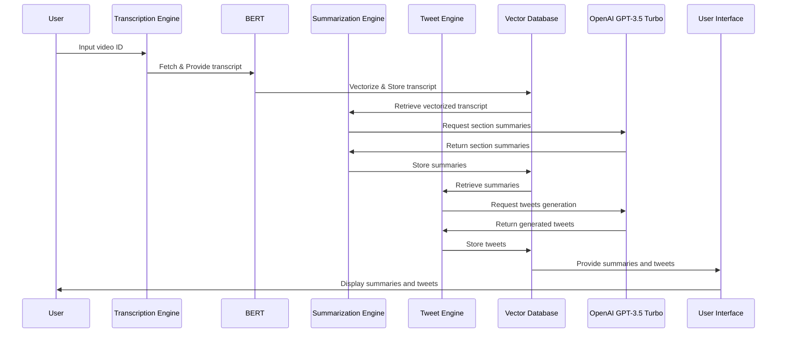

# YouTube2Tweets

## Overview
YouTube2Tweets is an application designed to transform YouTube video content into engaging and informative tweets. This tool leverages advanced Natural Language Processing (NLP) and AI technologies to transcribe videos, summarize their content, and generate tweets that are both insightful and appealing.

## How It Works
1. **Transcription**: The application starts by fetching the transcript of a YouTube video using the video's ID.
2. **Vectorization**: Utilizing BERT, a sophisticated NLP model, the transcript is vectorized for nuanced linguistic processing.
3. **Summarization**: The vectorized data is then used to generate concise section-wise and overall summaries of the video.
4. **Tweet Generation**: Leveraging OpenAI's GPT-3.5 Turbo model, the application crafts tweets from these summaries.
5. **Display**: All summaries and tweets are displayed in a user-friendly interface, with options to interact and explore the content.

## Application Architecture
To understand the architecture and flow of YouTube2Tweets, refer to the diagram below:

## Application Architecture
To understand the architecture and flow of YouTube2Tweets, refer to the diagram below:

## Features
- **Video Transcription**: Automated extraction of spoken content from YouTube videos.
- **Content Summarization**: Intelligent section-wise and overall summaries.
- **Tweet Generation**: Engaging tweets crafted using advanced AI models.
- **Interactive Interface**: User-friendly display of summaries and tweets.

## Usage
(TBA - Provide instructions on how to use the application, including any installation steps, usage guidelines, etc.)

## Contributing
Contributions to the YouTube2Tweets project are welcome! If you have suggestions, improvements, or want to contribute code, please feel free to open an issue or submit a pull request.

## License
(TBA - Specify the license under which the project is released, if applicable.)

## Acknowledgements
- BERT for transcript vectorization.
- OpenAI's GPT-3.5 Turbo for content generation.
- [Your Name/Organization] for project development.

---

For more information and updates, stay tuned to this repository.
